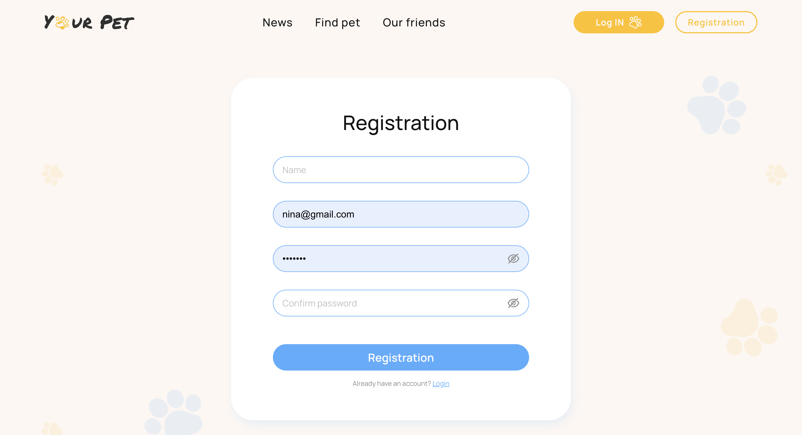
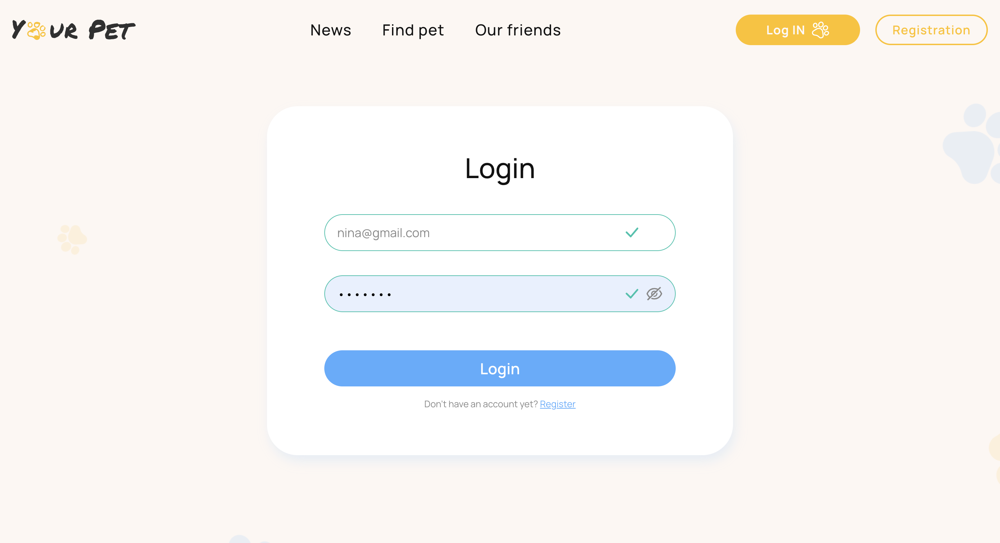
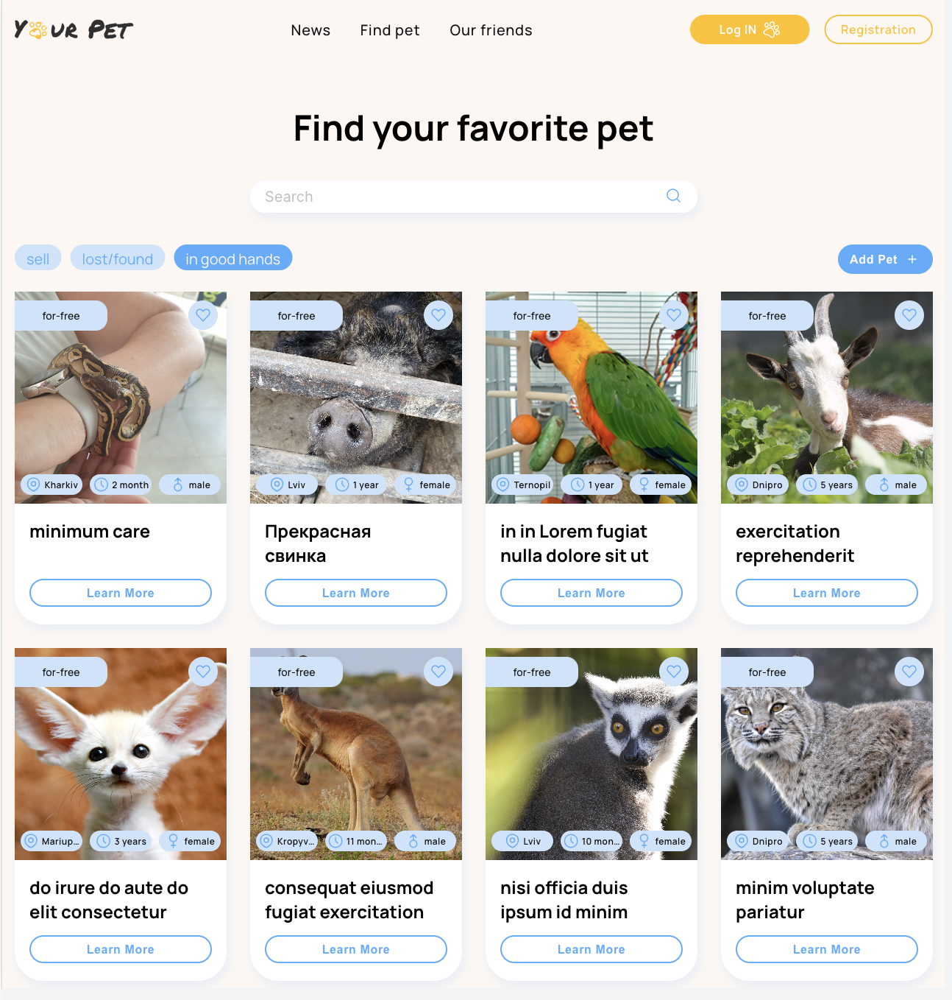

**GoIT React and Node.js Course**\
Team: **Project-F**
# Team Project Name: ***Your Pets App (Front-end part)***

## Team Members List:

Team Lead (FrontEnd)- **[Olha Munaieva](https://github.com/OlgaMunaieva)**\
Scrum Master - **[Ganna Baranenko](https://github.com/ganna1008)**


SharedLayout, MainPage, ErrorPage, ModalNotice, MainContainer, Routes, GlobalStyles, Favicon - **[Olha Munaieva](https://github.com/OlgaMunaieva)**\
Header, Navigation, Burger menu, Pagination, ModalApproveAction, Loader on NoticesPage - **[Sergii Moroz](https://github.com/MorozSerhii)**\
RegisterPage, LoginPage, AuthForm, ModalCongrats, ModalApproveAction - **[Dmytro Dobrobatko](https://github.com/Dobryotec)**\
NoticesPage, Add to Favorite, Filter by Category, Filter by Age and Gender, Deleting Notice, ModalApproveAction - **[Ivan Tolmachov](https://github.com/IvanTolmachev)**\
ModalApproveAction, ModalNotice - **[Vitalii Grytsun](https://github.com/Deus2214)**\
UserPage, Profile, UserData, UserForm, PetsCard, Action on the Avatar, Modals - **[Ganna Baranenko](https://github.com/ganna1008)**\
AddPetPage (AddPetForm) - **[Alexander Shevchenko](https://github.com/AlexanderShevchenko112)**\
OurFriendsPage - **[Demchenko Sergii](https://github.com/Demniks)**\
NewsPage, integrated Search, Pagination News - **[Kiril Polozhenets](https://github.com/polokir)**

## Materials used in the project

- [Project layout](https://www.figma.com/file/0jlTykBnzSdnXWKtRMxhSV/Your-Pet-2.0)
- [Technical task](https://docs.google.com/spreadsheets/d/1dIjUkjuaTIrfkApsZXky48ftkJ-NDMkHYSL7hPSPr0Y/edit)
- [BackEnd on render](https://project-savepets05-be.onrender.com/api-docs/)
- [BackEnd project](https://github.com/VadimVyalov/project-savePets05-BE)

## Tools

Project is built using the following tools:

- [HTML](https://developer.mozilla.org/en-US/docs/Web/HTTP)
- [CSS](https://developer.mozilla.org/en-US/docs/Web/CSS/Reference)
- [Java Script](https://developer.mozilla.org/en-US/docs/Web/JavaScript)
- [React](https://react.dev/reference/react)
- [GitHub](https://github.com/)
- [Postman](https://www.postman.com/)
- [Redux](https://redux.js.org/)
- [Axios](https://axios-http.com/ru/docs/intro)
- [Formik](https://formik.org/)
- [Lodash.debounce](https://lodash.com/docs/)
- [Styled-components](https://www.styled-components.com/)
- [yup](https://www.npmjs.com/package/yup)

## Project description

### MainPage
When you first enter the application using the link [Your Pets App](https://olgamunaieva.github.io/project-savePets05/), the user gets to the main page with a welcome message and a menu in the header (for mobile and desktop versions, this is a burger menu). By clicking on the logo, the user is taken to the main page.\
### Header
When clicking on the header menu items, an unauthorized user can get to Notices Page, NewsPage, OurFriendsPage with limited functionality (to be described below). For an authorized user, the functionality will be complete. On the right side of the window there is an authorization menu block. For an unauthorized user, this is Register and Login. For an authorized user, this is Logout and a link to UserPage.


### Registration page
 The user can register by clicking on the register button. He gets to the registration page, where filling out the form with data in the required format (messages are displayed if the data does not match the format) and clicking the Registration button, he gets the created profile. If the user is already registered, he will receive a message about this and can follow the login link at the bottom of the registration form.


### Login Page
 On the login page, the user needs to correctly fill in all the form fields, the form has hints for correct input. After filling in, by clicking on the login button, authorization occurs. If the user already exists in the database, then he is redirected to his profile page. Otherwise, a message is displayed stating that the user with the corresponding data does not exist in the database. From the login page, you can go to the registration page by clicking on the appropriate link at the bottom of the form.

### Notices Page





P.S.: This project is a modified clone of the original OlgaMunaieva repository.

# React homework template

Этот проект был создан при помощи
[Create React App](https://github.com/facebook/create-react-app). Для знакомства
и настройки дополнительных возможностей
[обратись к документации](https://facebook.github.io/create-react-app/docs/getting-started).

## Создание репозитория по шаблону

Используй этот репозиторий организации GoIT как шаблон для создания репозитория
своего проекта. Для этого нажми на кнопку `«Use this template»` и выбери опцию
`«Create a new repository»`, как показано на изображении.


На следующем шаге откроется страница создания нового репозитория. Заполни поле
его имени, убедись что репозиторий публичный, после чего нажми кнопку
`«Create repository from template»`.


После того как репозиторий будет создан, необходимо перейти в настройки
созданного репозитория на вкладку `Settings` > `Actions` > `General` как
показано на изображении.


Проскролив страницу до самого конца, в секции `«Workflow permissions»` выбери
опцию `«Read and write permissions»` и поставь галочку в чекбоксе. Это
необходимо для автоматизации процесса деплоя проекта.


Теперь у тебя есть личный репозиторий проекта, со структурой файлов и папок
репозитория-шаблона. Далее работай с ним как с любым другим личным репозиторием,
клонируй его себе на компьютер, пиши код, делай коммиты и отправляй их на
GitHub.

## Подготовка к работе

1. Убедись что на компьютере установлена LTS-версия Node.js.
   [Скачай и установи](https://nodejs.org/en/) её если необходимо.
2. Установи базовые зависимости проекта командой `npm install`.
3. Запусти режим разработки, выполнив команду `npm start`.
4. Перейди в браузере по адресу [http://localhost:3000](http://localhost:3000).
   Эта страница будет автоматически перезагружаться после сохранения изменений в
   файлах проекта.

## Деплой

Продакшн версия проекта будет автоматически проходить линтинг, собираться и
деплоиться на GitHub Pages, в ветку `gh-pages`, каждый раз когда обновляется
ветка `main`. Например, после прямого пуша или принятого пул-реквеста. Для этого
необходимо в файле `package.json` отредактировать поле `homepage`, заменив
`your_username` и `your_repo_name` на свои, и отправить изменения на GitHub.

```json
"homepage": "https://your_username.github.io/your_repo_name/"
```

Далее необходимо зайти в настройки GitHub-репозитория (`Settings` > `Pages`) и
выставить раздачу продакшн версии файлов из папки `/root` ветки `gh-pages`, если
это небыло сделано автоматически.


### Статус деплоя

Статус деплоя крайнего коммита отображается иконкой возле его идентификатора.

- **Желтый цвет** - выполняется сборка и деплой проекта.
- **Зеленый цвет** - деплой завершился успешно.
- **Красный цвет** - во время линтинга, сборки или деплоя произошла ошибка.

Более детальную информацию о статусе можно посмотреть кликнув по иконке, и в
выпадающем окне перейти по ссылке `Details`.


### Живая страница

Через какое-то время, обычно пару минут, живую страницу можно будет посмотреть
по адресу указанному в отредактированном свойстве `homepage`. Например, вот
ссылка на живую версию для этого репозитория
[https://goitacademy.github.io/react-homework-template](https://goitacademy.github.io/react-homework-template).

Если открывается пустая страница, убедись что во вкладке `Console` нет ошибок
связанных с неправильными путями к CSS и JS файлам проекта (**404**). Скорее
всего у тебя неправильное значение свойства `homepage` в файле `package.json`.

### Маршрутизация

Если приложение использует библиотеку `react-router-dom` для маршрутизации,
необходимо дополнительно настроить компонент `<BrowserRouter>`, передав в пропе
`basename` точное название твоего репозитория. Слеш в начале строки обязателен.

```jsx
<BrowserRouter basename="/your_repo_name">
  <App />
</BrowserRouter>
```

## Как это работает


1. После каждого пуша в ветку `main` GitHub-репозитория, запускается специальный
   скрипт (GitHub Action) из файла `.github/workflows/deploy.yml`.
2. Все файлы репозитория копируются на сервер, где проект инициализируется и
   проходит линтинг и сборку перед деплоем.
3. Если все шаги прошли успешно, собранная продакшн версия файлов проекта
   отправляется в ветку `gh-pages`. В противном случае, в логе выполнения
   скрипта будет указано в чем проблема.
